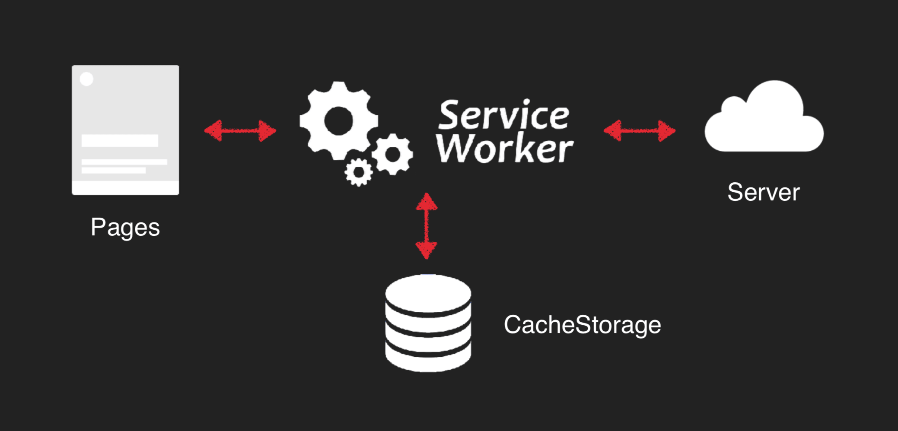

### 为什么用pwa

> 用户体验和用户留存枷锁

### pwa能解决什么

> 渐进式、可响应、可离线、实现类似 App 的交互、即时更新、安全、可以被搜索引擎检索、可推送、可安装、可链接

- 添加到桌面, 解决用户留存问题: App Manifest
- 离线访问: Service Worker
- 消息推送: Web Push

### App Manifest
- 触发应用添加横幅条件: 站点在同一浏览器中被访问至少两次，两次访问间隔至少为 5 分钟; ...

### Service Worker



- 控制控制策略：
```
static file: cacheFirst => fastest => cacheOnly
data AJAX: networkFirst => networkOnly
```

### Web Push
- Notification api
- push api

- [https://lavas.baidu.com](https://lavas.baidu.com)
